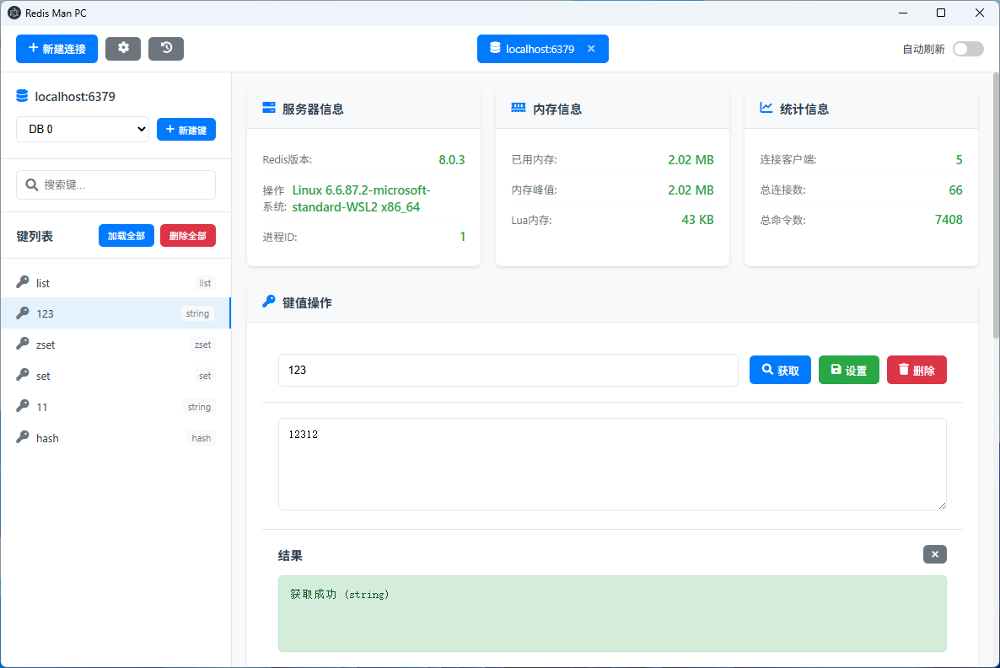
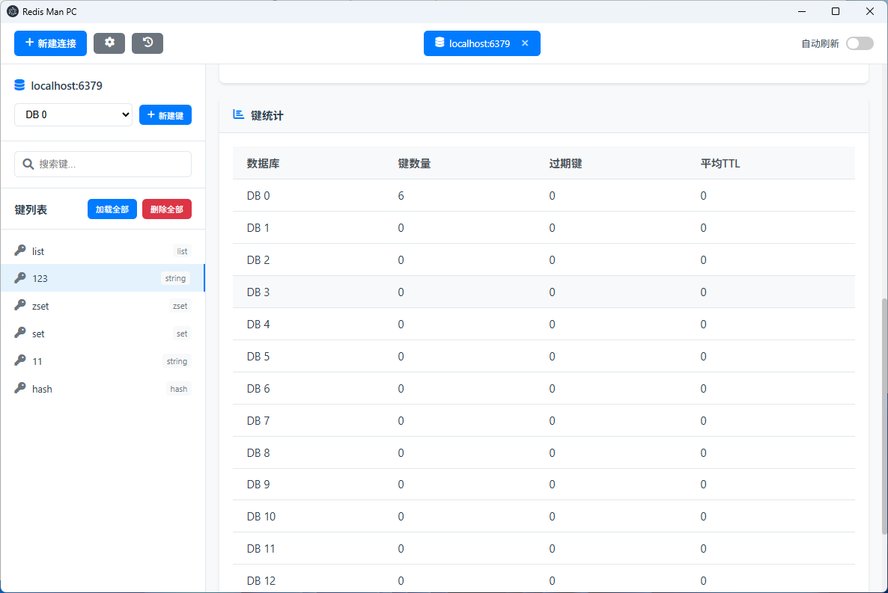

# Redis Man pc

一个基于 Electron 开发的现代化 Redis 桌面客户端，参考 Another Redis Desktop Manager 的设计风格。





## 功能特性

### 🎯 核心功能

- **多连接管理** - 支持管理多个 Redis 连接
- **数据库切换** - 支持在多个数据库之间切换
- **键值操作** - 支持获取、设置、删除键值
- **键类型支持** - 支持 String、Hash、List、Set、ZSet 等数据类型
- **实时监控** - 实时显示服务器信息、内存使用、连接统计等

### 🎨 界面特性

- **现代化设计** - 采用现代化的 UI 设计风格
- **响应式布局** - 支持不同屏幕尺寸
- **主题支持** - 支持浅色主题
- **图标支持** - 使用 Font Awesome 图标库

### 🔧 高级功能

- **键搜索** - 支持按键名搜索
- **自动刷新** - 支持自动刷新服务器信息
- **连接标签** - 支持多连接标签页管理
- **键统计** - 显示数据库键统计信息
- **错误处理** - 完善的错误提示和处理

## 安装和运行

### 环境要求

- Node.js 16.0 或更高版本
- npm 或 yarn

### 安装步骤

1. **克隆项目**
   
   ```bash
   git clone <repository-url>
   cd redis-man-pc
   ```

2. **安装依赖**
   
   ```bash
   npm install
   ```

3. **运行应用**
   
   ```bash
   npm start
   ```

### 构建应用

#### 本地构建

```bash
# 构建 Windows 安装包
npm run build:win

# 构建 Linux 安装包
npm run build:linux

# 构建 macOS 安装包
npm run build:mac

# 构建所有平台安装包
npm run build
```

#### 自动构建

项目配置了 GitHub Actions 自动构建流程：

1. **推送标签触发构建**
   
   ```bash
   git tag v1.0.0
   git push origin v1.0.0
   ```

2. **手动触发构建**
   
   - 在 GitHub 仓库页面点击 "Actions"
   - 选择 "Build and Release" 工作流
   - 点击 "Run workflow"

3. **使用发布脚本（推荐）**
   
   ```bash
   # 发布补丁版本 (1.0.0 -> 1.0.1)
   node release.js patch
   
   # 发布次要版本 (1.0.0 -> 1.1.0)
   node release.js minor
   
   # 发布主要版本 (1.0.0 -> 2.0.0)
   node release.js major
   
   # 发布指定版本
   node release.js 1.2.3
   ```

构建完成后，安装包会自动上传到 GitHub Releases。

## 下载安装

### 最新版本

访问 [GitHub Releases](https://github.com/your-username/redis-man-pc/releases) 下载最新版本的安装包：

- **Windows**: `Redis Man PC Setup x.x.x.exe`
- **Linux**: `redis-man-pc-x.x.x.AppImage` 或 `redis-man-pc_x.x.x_amd64.deb`
- **macOS**: `Redis Man PC-x.x.x.dmg`

### 系统要求

- **Windows**: Windows 10 或更高版本
- **Linux**: Ubuntu 18.04+ 或其他支持 AppImage 的发行版
- **macOS**: macOS 10.14+ (Mojave 或更高版本)

## 使用说明

### 连接管理

1. **新建连接**
   
   - 点击工具栏的"新建连接"按钮
   - 填写连接信息（主机、端口、密码等）
   - 点击"连接"按钮

2. **管理连接**
   
   - 连接列表显示在顶部标签栏
   - 点击标签切换连接
   - 点击标签上的关闭按钮删除连接

### 键值操作

1. **查看键**
   
   - 在左侧键列表中点击键名
   - 或手动输入键名后点击"获取"按钮

2. **设置键值**
   
   - 输入键名和值
   - 点击"设置"按钮保存

3. **删除键**
   
   - 输入键名
   - 点击"删除"按钮

### 数据库管理

1. **切换数据库**
   
   - 在左侧面板的数据库选择器中选择数据库

2. **查看统计**
   
   - 在底部的键统计面板查看数据库统计信息

## 项目结构

```
redis-man-pc/
├── main.js              # 主进程文件
├── preload.js           # 预加载脚本
├── package.json         # 项目配置
├── renderer/            # 渲染进程文件
│   ├── index.html       # 主页面
│   ├── index.js         # 渲染进程脚本
│   └── style.css        # 样式文件
└── README.md           # 项目说明
```

## 技术栈

- **Electron** - 跨平台桌面应用框架
- **Node.js** - JavaScript 运行时
- **Redis** - Redis 客户端库
- **HTML5/CSS3** - 前端技术
- **JavaScript ES6+** - 现代 JavaScript

## 开发说明

### 开发模式

```bash
# 启动开发模式
npm run dev
```

### 代码规范

- 使用 ES6+ 语法
- 遵循 JavaScript 标准规范
- 使用 Prettier 格式化代码

### 调试

- 使用 Chrome DevTools 调试渲染进程
- 使用 Node.js 调试器调试主进程

## 贡献指南

1. Fork 项目
2. 创建功能分支 (`git checkout -b feature/AmazingFeature`)
3. 提交更改 (`git commit -m 'Add some AmazingFeature'`)
4. 推送到分支 (`git push origin feature/AmazingFeature`)
5. 打开 Pull Request

## 许可证

本项目采用 ISC 许可证 - 查看 [LICENSE](LICENSE) 文件了解详情。

## 更新日志

### v1.0.0

- 初始版本发布
- 支持基本的 Redis 连接和操作
- 现代化 UI 设计
- 多连接管理
- 实时监控功能
